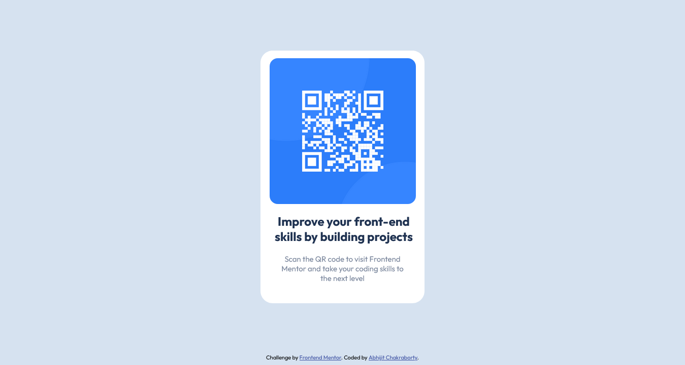

# Frontend Mentor - QR code component solution

This is a solution to the [QR code component challenge on Frontend Mentor](https://www.frontendmentor.io/challenges/qr-code-component-iux_sIO_H). Frontend Mentor challenges help you improve your coding skills by building realistic projects. 

## Table of contents

- [Overview](#overview)
  - [Screenshot](#screenshot)
  - [Links](#links)
- [My process](#my-process)
  - [Built with](#built-with)
  - [What I learned](#what-i-learned)
  - [Continued development](#continued-development)
  - [Useful resources](#useful-resources)
- [Author](#author)

**Note: Delete this note and update the table of contents based on what sections you keep.**

## Overview

### Screenshot

### Links

- Solution URL: [Add solution URL here](https://your-solution-url.com)
- Live Site URL: [Add live site URL here](https://your-live-site-url.com)

## My process

### Built with

- Semantic HTML5 markup
- CSS custom properties

### What I learned

This being the very first go at a project idea, I have used margins and padding to get the layout as provided in sample design. I am willing to update the code as I learn more about development and better ways to handle specific problems.

Thanks to a Stackoverflow response as mentioned below, I was able to fix the content background size using `display: inline-block`

I had problems coming up with the correct value for margin between qr code and main content. So tried eye balling the figure and for now kept at what I felt to be more or less close to the original design.

### Continued development

To make this design more robust, I will have to get a better grasp on how to align content in a systematic way.

### Useful resources

- [Stackoverflow](https://stackoverflow.com/a/27383014) The solution helped me to fix the layout overflowing issue wiht dynamic screen sizes.

## Author

- Website - [Add your name here](https://www.your-site.com)
- Frontend Mentor - [@abhijitchak103](https://www.frontendmentor.io/profile/abhijitchak103)

